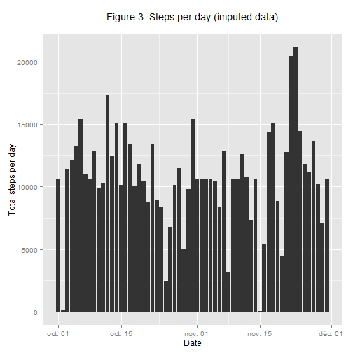

## Introduction
It is now possible to collect a large amount of data about personal movement using activity monitoring devices such as a [Fitbit][1], [Nike Fuelband][2], or [Jawbone Up][3].  
These type of devices are part of the "quantified self" movement -- a group of enthusiasts who take measurements about themselves regularly to improve their health, to find patterns in their behavior, or because they are tech geeks. But these data remain under-utilized both because the raw data are hard to obtain and there is a lack of statistical methods and software for processing and interpreting the data.

This assignment makes use of data from a personal activity monitoring device. This device collects data at 5 minute intervals through out the day.  
The data consists of two months of data from an anonymous individual collected during the months of October and November, 2012 and include the number of steps taken in 5 minute intervals each day.  

Let's prepare our environment :

```r
# to be able to read all code chunks, and place plots in the expected folder
library(knitr)
opts_chunk$set(echo=TRUE, fig.path="figures/")
# libraries used
library(ggplot2)
```

## Loading and preprocessing the data
Data are stored in an archive file (activity.zip), in a comma separated format (csv).

### 1. Load the data

```r
unzip("activity.zip")
```

```
## Warning in unzip("activity.zip"): error 1 in extracting from zip file
```

```r
unlink("activity.zip")
activity <- read.csv("activity.csv", stringsAsFactors = FALSE)
```
### 2. Process / transform the data

```r
# Change class for the date variable
activity$date <- as.Date(activity$date)
```
Each observation contains 3 variables :

* the number of steps `steps`; missing values coded as `NA`
* the date `date` in YYYY_MM-DD format
* a label for the 5 minute interval `interval` in an hhmm format (hh : hour, 0 to 23; mm : minutes, 0 to 55 in a 5 min steps).

Let's have a look to a sample of the dataset : 

```r
head(activity)
```

```
##   steps       date interval
## 1    NA 2012-10-01        0
## 2    NA 2012-10-01        5
## 3    NA 2012-10-01       10
## 4    NA 2012-10-01       15
## 5    NA 2012-10-01       20
## 6    NA 2012-10-01       25
```

## What is mean total number of steps taken per day?

For this part, we ignore the mission values in the dataset.

### 1.make a histogram of the total number of steps taken each day.

```r
# Aggregate data by day
activityDay <- aggregate(steps~date, data = activity, FUN = sum, na.rm=TRUE)
# Plot histogram with ggplot2
histo <- ggplot (activityDay, aes(x=date, y=steps))
histo + geom_histogram(stat="identity") +
        labs(title='Figure 1: Steps per day\n', y='Total steps per day', x='Date')
```

 

### 2. Calculate and report the mean and median total number of steps taken daily

```r
mean_steps <- mean(activityDay$steps, na.rm=TRUE)
median_steps <- median(activityDay$steps, na.rm=TRUE)
```
**Mean** number of steps taken per day =   10766.19  
**Median** number of steps taken per day = 10765.00


## What is the average daily activity pattern?

### 1. Make a time series plot (i.e. type = "l") of the 5-minute interval (x-axis) and the average number of steps taken, averaged across all days (y-axis)

First, we aggregate the mean (average) number of steps by interval, and use these values to make the desired plot.  

```r
activityInterval <- aggregate(steps~interval, data=activity, FUN=mean, na.rm=TRUE)
stepByInterval <- ggplot (activityInterval, aes(x=interval, y=steps))
stepByInterval + geom_line() +
        labs(title='Figure 2: Steps per interval\n', y='Average number steps per day', x='Interval')
```

 

### 2. Which 5-minute interval, on average across all the days in the dataset, contains the maximum number of steps?


```r
maxStepInterval <- activityInterval[which.max(activityInterval$steps),]$interval
```

The interval identied as 835 contains the maximum number of steps, on average across all the days.

## Imputing missing values

There are a number of days/intervals where there are missing values (coded as NA). The presence of missing days may introduce bias into some calculations or summaries of the data.

### 1. Calculate and report the total number of missing values in the dataset (i.e. the total number of rows with NAs)


```r
totalNA <- sum(!complete.cases(activity))
stepNA <- sum(is.na(activity$steps))
```

Total number of missing values in the dataset : 2304, with 2304 values missing in the variable `step`.  
So, no missing value for the other vaariables.

### 2. Devise a strategy for filling in all of the missing values in the dataset. The strategy does not need to be sophisticated. For example, you could use the mean/median for that day, or the mean for that 5-minute interval, etc.

To fill in missing values, we choose to replace them with the mean value, as calculated before, at the same interval across days. 

### 3. Create a new dataset that is equal to the original dataset but with the missing data filled in.


```r
imputedActivity = activity
for (i in 1:dim(imputedActivity)[1]) {
        if (is.na(imputedActivity[i,]$steps)) {
                interval = imputedActivity[i,]$interval
                repval = floor(activityInterval[activityInterval$interval == interval,]$steps)
                imputedActivity[i,]$steps = repval
        }
}
```

let's check is there are still missing values :


```r
totalNA <- sum(!complete.cases(imputedActivity))
```
There is 0 missing value in the `imputedActivity` dataset.

### 4. Make a histogram of the total number of steps taken each day and Calculate and report the mean and median total number of steps taken per day. Do these values differ from the estimates from the first part of the assignment? What is the impact of imputing missing data on the estimates of the total daily number of steps?


```r
# Aggregate data by day
imputedActivityDay <- aggregate(steps~date, data = imputedActivity, FUN = sum, na.rm=TRUE)
# Plot histogram with ggplot2
histo2 <- ggplot (imputedActivityDay, aes(x=date, y=steps))
histo2 + geom_histogram(stat="identity") +
        labs(title='Figure 3: Steps per day (imputed data)\n', y='Total steps per day', x='Date')
```

 


```r
mean_steps2 <- mean(imputedActivityDay$steps, na.rm=TRUE)
median_steps2 <- median(imputedActivityDay$steps, na.rm=TRUE)
```

Quantity                              | Initial dataset                              | Imputed dataset
--------------------------------------|----------------------------------------------|------------------------------ 
**Mean** number of steps taken per day |  10766.19 | 10749.77
**Median** number of steps taken per day | 10765.00 | 10641.00

it seems that the impact of imputing missing values on the total number of daily steps is negligible, 

## Are there differences in activity patterns between weekdays and weekends?

### 1. Create a new factor variable in the dataset with two levels - "weekday" and "weekend" indicating whether a given date is a weekday or weekend day.

The assignement's instructions suggested the use of the weekdays() function to assign a level "weekday" or "weekend" to the day of observation. The results of that function is depends of the locale used by the computer running it (french as I am concerned).  
We will use the conversion '%u', which returns the weekday as a number (monday=1), instead of plain text name of days. This leads to a non locale-specific method.


```r
imputedActivity$we <- factor(ifelse(as.integer(format(imputedActivity$date, format = '%u')) %in% c(1:5),'weekday', 'weekend'))
```

### 2. Make a panel plot containing a time series plot (i.e. type = "l") of the 5-minute interval (x-axis) and the average number of steps taken, averaged across all weekday days or weekend days (y-axis).


```r
activityIntervalWe <- aggregate(steps~interval + we, data=imputedActivity, FUN=mean)
stepByIntervalWe <- ggplot (activityIntervalWe, aes(x=interval, y=steps))
stepByIntervalWe + geom_line() +
        facet_grid(we~.) +
        labs(title='Figure 4: Steps per interval\n', y='Average number steps per day', x='Interval')
```

 


[1]:http://www.fitbit.com/ "Fitbit"
[2]:http://www.nike.com/us/en_us/c/nikeplus-fuelband/ "Nike Fuelband"
[3]:https://jawbone.com/up/ "Jawbone Up"
